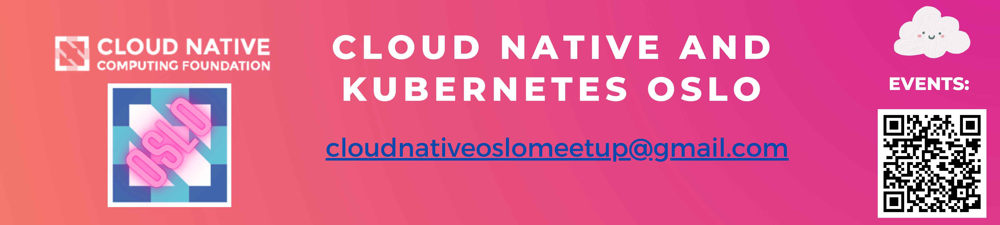

# Welcome to Cloud Native and Kubernetes Oslo GitHub! 👋

## Introduction

Cloud Native and Kubernetes Oslo is the official Cloud Native Computing Foundation Meetup group about the techonologies hosted under CNCF umbrella.

We host talks from anyone doing cool things with Kubernetes, and the other CNCF technoligies, including companies using them in production or vendors who are pushing the boundaries of what the cloud native techs can do.

Presenations will be focused on demos, and not sales pitches. The meetup will be organized in an open and democratic way, where anyone that wants to help out organizing will be welcome.

We believe in open sponsorships, so anyone can cover the cost of food, space, and travel for speakers. Organizations donating speakers, food/drinks, or space will automatically count as sponsors for the event.

## Repo structure

Currently we have a single repo, [meetups](https://github.com/Cloud-Native-and-Kubernetes-Oslo/meetups) where we upload resources shared by the speakers and organizers for the respective meetup events. 

## Social links
All of our meetups with respective updates are announced on our meetup.com page so please ensure that you've joined as a member there: https://www.meetup.com/cloud-native-and-kubernetes-oslo

Other links that you should know of:

- E-mail you can reach us at with any inquires, ideas or feedback that you may have: [cloudnativeoslomeetup@gmail.com](cloudnativeoslomeetup@gmail.com)
- Official CNCF chapter page: https://community.cncf.io/cloud-native-and-kubernetes-oslo
- YouTube channel where we upload meetup recordings: https://www.youtube.com/channel/UCJV43megnXMoVm5uYeu4NwA
- Sessionize page where we continuously accept suggestions for future meetup sessions: https://sessionize.com/cloud-native-and-kubernetes-oslo/

## Contributing and Support

Currently Cloud Native and Kubernetes Oslo is driven by:
- **Steffen Pøhner Henriksen**
- **Kristina Devochko**
- **Bosse Klykken**
- **Emil Antoni Brasø**

We're always open for any feedback, ideas or help from the community!
If you would like to help us with:

- the location for our next meetup,
- sponsoring food and drinks for our next meetup,
- speaking at our next meetup,

please reach out to any of the organizers directly or by contacting us at any of the provided social links above!🤗
